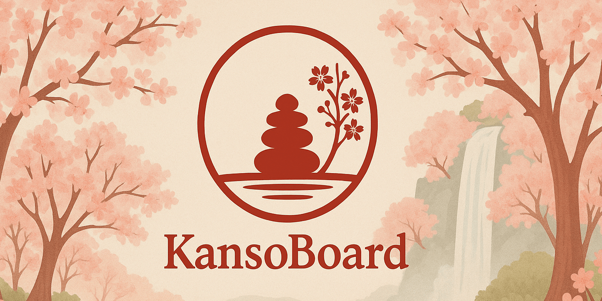

<p align="center">
  
</p>

<h1 align="center">KansoBoard</h1>

<p align="center">
  A modern, minimalist and zen Kanban board.
</p>

---

## ✨ Presentation

**KansoBoard** is a lightweight, streamlined, and productivity-focused Kanban application.
Designed to be simple yet scalable, it offers a Zen-like visual environment inspired by Japan: cherry blossoms, sand, calm, and simplicity.

The project consists of:

- **An Angular 21 frontend (standalone + stores)**
- **A .NET 9 backend (Minimal API + EF Core, code-first)**
- **An embedded database persisted via Docker**
- **A REST API enabling integration with Discord or other platforms via webhooks**

---

## 🧱 Planned Features

- Multi-user support
- Multiple projects
- Invitation via shareable link
- Customizable Kanban boards
- Editable columns
- Cards with:
  - Type (Issue, Feature…)
  - User assignment
  - Prioritization
- Status based on column
- Native drag & drop
- Outgoing webhooks for Discord integration
- Full containerization (Docker / Docker Compose)


---

## 🚀 Objectives

Create a simple, intuitive, visually appealing tool that is easy to integrate into a personal workflow or for a small informal team.

---

## 📦 Project architecture

```
/
├─ Api/               → Backend .NET 9
├─ Front/             → Frontend Angular 21
├─ Images/            → Images
└─ docker-compose.yml → Stack Docker
```

---

## 📜 License

MIT
